<!--
   Copyright 2026 UCP Authors

   Licensed under the Apache License, Version 2.0 (the "License");
   you may not use this file except in compliance with the License.
   You may obtain a copy of the License at

       http://www.apache.org/licenses/LICENSE-2.0

   Unless required by applicable law or agreed to in writing, software
   distributed under the License is distributed on an "AS IS" BASIS,
   WITHOUT WARRANTIES OR CONDITIONS OF ANY KIND, either express or implied.
   See the License for the specific language governing permissions and
   limitations under the License.
-->

# Architecture Diagrams

This page provides interactive visual diagrams to help understand the
Universal Commerce Protocol (UCP) architecture, data flows, and component
relationships.

## Protocol Overview

The following diagram shows the high-level relationships between UCP
participants and core components:

```mermaid
graph TB
    subgraph "Consumer Layer"
        U[👤 User]
        P[🤖 Platform/Agent]
    end

    subgraph "UCP Protocol"
        PROF[📋 Business Profile]
        CAP[⚡ Capabilities]
        EXT[🔌 Extensions]
        SVC[🔗 Services]
    end

    subgraph "Business Layer"
        B[🏪 Business/Merchant]
        INV[📦 Inventory]
        ORDER[📝 Orders]
    end

    subgraph "Payment Layer"
        CP[🔐 Credential Provider]
        PSP[💳 Payment Service Provider]
    end

    U -->|"Interacts with"| P
    P -->|"Discovers"| PROF
    PROF -->|"Exposes"| CAP
    CAP -->|"Enhanced by"| EXT
    CAP -->|"Delivered via"| SVC
    SVC -->|"Connects to"| B
    B -->|"Manages"| INV
    B -->|"Creates"| ORDER
    P -->|"Requests tokens"| CP
    B -->|"Processes payments"| PSP
    CP -->|"Issues tokens to"| PSP

    classDef consumer fill:#e1f5fe,stroke:#01579b
    classDef protocol fill:#f3e5f5,stroke:#4a148c
    classDef business fill:#e8f5e9,stroke:#1b5e20
    classDef payment fill:#fff3e0,stroke:#e65100

    class U,P consumer
    class PROF,CAP,EXT,SVC protocol
    class B,INV,ORDER business
    class CP,PSP payment
```

## Checkout Flow Sequence

The checkout process involves multiple actors coordinating through the protocol:

## Capability & Extension Architecture

UCP's modular architecture allows capabilities to be extended with optional
features:

```mermaid
graph LR
    subgraph "Core Capabilities"
        CHECKOUT[Checkout<br/>⚡ Core]
        ORDER[Order<br/>⚡ Core]
        IDENTITY[Identity Linking<br/>⚡ Core]
    end

    subgraph "Checkout Extensions"
        DISC[Discounts<br/>🔌 Extension]
        FULFILL[Fulfillment<br/>🔌 Extension]
        AP2[AP2 Mandates<br/>🔌 Extension]
        CONSENT[Buyer Consent<br/>🔌 Extension]
    end

    subgraph "Service Bindings"
        REST[REST/HTTP<br/>🌐]
        MCP_SVC[MCP<br/>🤖]
        A2A[A2A<br/>🔄]
        EP[Embedded<br/>📱]
    end

    CHECKOUT --> DISC
    CHECKOUT --> FULFILL
    CHECKOUT --> AP2
    CHECKOUT --> CONSENT

    CHECKOUT --> REST
    CHECKOUT --> MCP_SVC
    CHECKOUT --> A2A
    CHECKOUT --> EP

    ORDER --> REST
    IDENTITY --> REST

    classDef core fill:#bbdefb,stroke:#1976d2,stroke-width:2px
    classDef extension fill:#c8e6c9,stroke:#388e3c
    classDef service fill:#ffe0b2,stroke:#f57c00

    class CHECKOUT,ORDER,IDENTITY core
    class DISC,FULFILL,AP2,CONSENT extension
    class REST,MCP_SVC,A2A,EP service
```

## Payment Handler Data Flow

This diagram illustrates how payment credentials flow securely through the
system:

```mermaid
flowchart TB
    subgraph "User Device"
        WALLET[💳 Digital Wallet]
        BIOMETRIC[🔐 Biometric Auth]
    end

    subgraph "Credential Provider"
        AUTH[Authentication<br/>Service]
        TOKEN[Token<br/>Generation]
        VAULT[Secure<br/>Vault]
    end

    subgraph "Platform"
        AGENT[🤖 AI Agent]
        HANDLER[Payment<br/>Handler]
    end

    subgraph "Business"
        CHECKOUT_SVC[Checkout<br/>Service]
    end

    subgraph "PSP"
        GATEWAY[Payment<br/>Gateway]
        NETWORK[Card<br/>Network]
    end

    WALLET -->|"1. User selects"| AUTH
    AUTH -->|"2. Challenge"| BIOMETRIC
    BIOMETRIC -->|"3. Verified"| AUTH
    AUTH -->|"4. Authorized"| TOKEN
    VAULT -->|"Encrypted creds"| TOKEN
    TOKEN -->|"5. Payment token"| HANDLER
    HANDLER -->|"6. Token in request"| CHECKOUT_SVC
    CHECKOUT_SVC -->|"7. Process payment"| GATEWAY
    GATEWAY -->|"8. Authorize"| NETWORK
    NETWORK -->|"9. Approved"| GATEWAY
    GATEWAY -->|"10. Confirmation"| CHECKOUT_SVC
    CHECKOUT_SVC -->|"11. Order created"| AGENT

    style VAULT fill:#ffcdd2,stroke:#c62828
    style TOKEN fill:#c8e6c9,stroke:#2e7d32
    style BIOMETRIC fill:#bbdefb,stroke:#1565c0
```

## Schema Composition

UCP schemas use JSON Schema composition patterns for extensibility:

## State Machine: Checkout Lifecycle

The checkout object progresses through defined states:

## Transport Binding Comparison

Different service bindings serve different use cases:

```mermaid
graph TB
    subgraph "REST/HTTP Binding"
        REST_TITLE[🌐 Traditional Web APIs]
        REST_PROS[✅ Widely supported<br/>✅ Stateless<br/>✅ Cacheable]
        REST_CONS[⚠️ No real-time push<br/>⚠️ Polling required]
    end

    subgraph "MCP Binding"
        MCP_TITLE[🤖 AI Agent Native]
        MCP_PROS[✅ Tool/Resource model<br/>✅ Agent-optimized<br/>✅ Context-aware]
        MCP_CONS[⚠️ Newer standard<br/>⚠️ Limited adoption]
    end

    subgraph "A2A Binding"
        A2A_TITLE[🔄 Agent-to-Agent]
        A2A_PROS[✅ Multi-agent<br/>✅ Async workflows<br/>✅ Negotiation]
        A2A_CONS[⚠️ Complex setup<br/>⚠️ State management]
    end

    subgraph "Embedded Binding"
        EP_TITLE[📱 Platform Integration]
        EP_PROS[✅ Native UX<br/>✅ Direct control<br/>✅ Offline capable]
        EP_CONS[⚠️ Platform-specific<br/>⚠️ Integration effort]
    end

    CLIENT[Client Application] --> REST_TITLE
    CLIENT --> MCP_TITLE
    CLIENT --> A2A_TITLE
    CLIENT --> EP_TITLE

    classDef binding fill:#e8eaf6,stroke:#3f51b5
    class REST_TITLE,MCP_TITLE,A2A_TITLE,EP_TITLE binding
```

## Next Steps

- Learn about [Core Concepts](core-concepts.md) in detail
- Explore the [Checkout Capability](../specification/checkout.md)
- See the complete [Schema Reference](../specification/reference.md)
- Try the interactive [Playground](../playground.md)
