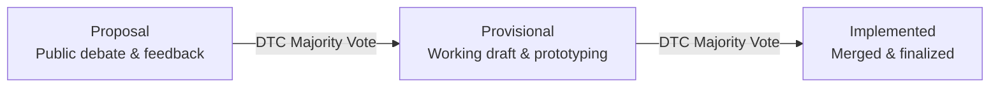
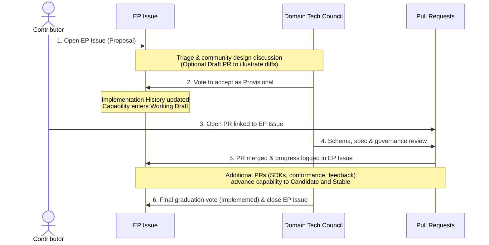
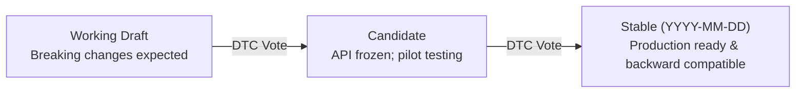

# Contributing to UCP

We welcome community contributions, patches, and feedback to help build and evolve the Universal Commerce Protocol (UCP). Whether you are fixing typos, improving documentation, writing SDK code, or proposing protocol extensions, your participation helps establish an open standard for agentic commerce.

---

## Your First Contribution

Find something to work on:

* **Documentation Improvements**: Improve code snippets, clarify specification text, fix typos or update broken links.
* **Good First Issues**: Browse open issues tagged with `status:needs-triage`.
* **Schema Examples**: Create or update schema example payloads (`source/schemas/` or `specification/examples/`) to illustrate protocol capabilities.
* **SDK & Conformance Enhancements**: Fix bugs or expand test coverage in `python-sdk`, `js-sdk`, or `conformance`.

### Small Changes (Direct PR)

Routine fixes and minor updates can be submitted directly as pull requests:

* Bug fixes and typo corrections
* Clarifications to documentation or schema property descriptions
* Schema examples and tutorial additions
* Non-breaking SDK adjustments and test improvements

### Major Changes (Enhancement Proposal Required)

Any significant change to the protocol requires a formal Enhancement Proposal (EP) submitted via the [Enhancement Proposal Template](https://github.com/Universal-Commerce-Protocol/ucp/issues/new?template=enhancement-proposal.yml){ target="_blank" } and requires Domain Tech Council (DTC) approval.

Significant changes include:

* **Core Schema Modifications**: Adding, removing, or modifying fields or descriptions in JSON schemas.
* **Protocol Changes**: Altering communication flows or expected capability behaviors (Checkout, Cart, Catalog, Order, Identity Linking).
* **New API Endpoints / Transports**: Introducing new transport bindings (REST, MCP, A2A, Embedded) or new protocol endpoints.
* **Backwards Incompatibility**: Any breaking change requiring a major version increment.

---

## Enhancement Proposal Lifecycle

An Enhancement Proposal tracks a protocol change through three lifecycle phases:

| Phase | Status & Description |
|---|---|
| **Proposal** | Submitted by any community member; debated publicly by the community and Domain Tech Council. |
| **Provisional** | Approved by DTC majority vote; enters working draft iteration and prototyping phase. |
| **Implemented** | Finalized by DTC majority vote; code, schemas, and documentation are complete and merged. |

Every Enhancement Proposal issue must follow the standard template requiring:

* **Summary**: High-level executive summary of the change.
* **Motivation**: Problem statement and user value.
* **Detailed Design**: Technical specification, schema impact, API surface, and edge cases.
* **Risks**: Compatibility, migration considerations, and security implications.
* **Test Plan**: Verification strategy across transports and conformance suites.
* **Graduation Criteria**: Requirements for advancing to Candidate and Stable tiers.

### How Enhancement Proposal Issues and Pull Requests Work Together

An Enhancement Proposal (EP) separates **design alignment** from **code and schema delivery** using two linked GitHub artifacts:

* **The EP Issue (Design & Lifecycle Tracker)**: Opened via the [Enhancement Proposal template](https://github.com/Universal-Commerce-Protocol/ucp/issues/new?template=enhancement-proposal.yml){ target="_blank" } (labeled `enhancement-proposal`). It serves as the single source of truth for the *why* and *what* - capturing the motivation, detailed design, risks, test plan, graduation criteria, and an ongoing `Implementation History` log. The EP Issue remains open across the capability's lifecycle until the capability graduates to **Stable** (`Implemented`).
* **The Pull Request(s) (Concrete Implementation)**: Deliver the *how* - such as JSON Schemas (`source/`), specification documentation (`docs/specification/`), SDK models, conformance tests, and samples. Every PR implementing an EP must link back to the tracking issue under `## Related Issues` in the PR description (using `Part of #<issue-number>` for incremental PRs or `Fixes #<issue-number>` when completing final graduation).

#### Step-by-Step Workflow

1. **Open the EP Issue First (`Proposal` Phase)**:
   Before writing full implementation code or opening a mergeable PR, submit the EP Issue. *(Optional: You may open a **Draft PR** linked to the EP Issue if concrete JSON Schema diffs or prototype code help illustrate your design, but implementation PRs will not be merged before the EP reaches `Provisional` status.)*
2. **Design Review & Provisional Approval (`Proposal` → `Provisional`)**:
   Triagers label the EP Issue by functional domain (e.g., `area:shopping`, `area:payments`, `area:lodging`, `area:food`, `area:common`) and route it to the relevant **Domain Working Group (DWG)** and **Domain Tech Council (DTC)**. Once open design questions are resolved, the DTC votes on whether to accept the proposal as **Provisional** and records the decision in the issue's `Implementation History` section.
3. **Submit Implementation PRs (`Provisional` / `Working Draft`)**:
   Once the EP Issue is approved as **Provisional**, open (or mark *Ready for Review*) your implementation PR(s) referencing `Part of #<EP-issue-number>`. Larger proposals often span multiple PRs across repositories (for example, landing the core schema and spec in `ucp`, followed by validation rules in `ucp-schema`, SDK support in `python-sdk`/`js-sdk`, and tests in `conformance`).
4. **Iterate Toward Graduation (`Candidate` → `Implemented`)**:
   As implementation PRs merge and real-world adoption feedback is addressed, maintainers update the `Implementation History` in the EP Issue. Once graduation criteria and conformance testing are satisfied, the DTC holds a final vote to promote the capability to **Stable** (`Implemented`), and the EP Issue is closed.

---

## Capability Maturity Levels

Once an Enhancement Proposal reaches Provisional status, new capabilities advance through three maturity levels:

| Level | Version Tag | Stability Guarantee | Purpose | Exit Criteria |
|---|---|---|---|---|
| **Working Draft** | `Working Draft` | Breaking changes expected | Prototyping, gathering feedback, iterating on design | DTC majority vote to advance |
| **Candidate** | `Candidate` | API surface stable; implementation details evolve | Early adopter implementations, production pilots | DTC majority vote to advance |
| **Stable** | `YYYY-MM-DD` | Full backward compatibility within major version | Production deployments | Date-based version assigned |

---

## Repository Structure

The Universal Commerce Protocol ecosystem is organized into dedicated Git repositories under the Universal-Commerce-Protocol GitHub organization:

* **`🏠 /ucp`**: Core specification repository, protocol definitions, website (ucp.dev), and specification site generator.
* **`📜 /ucp-schema`**: JSON schemas and Rust-based validation and generation tooling.
* **`🧪 /conformance`**: Protocol conformance test suite written in pytest.
* **`⚙️ /python-sdk` & `/js-sdk`**: Official language SDKs generated from protocol schemas.
* **`🔎 /samples`**: Reference merchant implementations (FastAPI, Node.js).
* **`♥️ /.github`**: Organization-wide health files, issue templates (`enhancement-proposal.yml`, `bug-report.yml`), and community governance defaults.

---

## Checklist Before Opening Your First PR

* [x] **Pre-flight**: Is there an existing issue tracking this bug/feature, and is it assigned to you?
* [x] **Branching**: Are you branching off `main` and keeping commits atomic?
* [x] **Validation**: Did you run the local linters, schema validator, and conformance suite?
* [x] **PR Description**: Does your PR clearly state **Why** the change was made, **What** changed, and link to the relevant issue?

---

## Getting Started

### Get started today

Interested in contributing to UCP but not sure where to start? Take a look at our [Core Concepts](core-concepts.md) page to learn about the protocol architecture or the [Contributing](http://github.com/Universal-Commerce-Protocol/.github/blob/main/CONTRIBUTING.md) page on GitHub to learn more about the contributing process, submitting a PR and our community guidelines.

You can also review our [samples](https://github.com/Universal-Commerce-Protocol/samples) for implementation examples and don’t forget to join our [GitHub Discussions](https://github.com/Universal-Commerce-Protocol/ucp/discussions).
