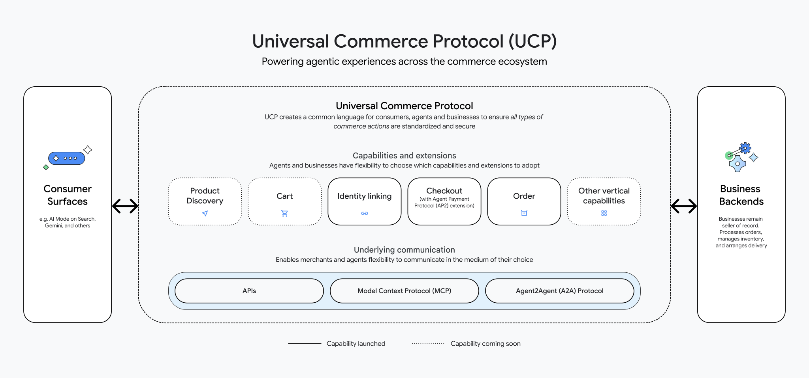

<!--
   Copyright 2025 UCP Authors

   Licensed under the Apache License, Version 2.0 (the "License");
   you may not use this file except in compliance with the License.
   You may obtain a copy of the License at

       http://www.apache.org/licenses/LICENSE-2.0

   Unless required by applicable law or agreed to in writing, software
   distributed under the License is distributed on an "AS IS" BASIS,
   WITHOUT WARRANTIES OR CONDITIONS OF ANY KIND, either express or implied.
   See the License for the specific language governing permissions and
   limitations under the License.
-->

# Core Concepts

## Architecture overview

{style="width:100%"}

The UCP architecture is built on a modular framework designed to define how
entities interact. It consists of the following fundamental components:

### Capabilities

Capabilities are the standalone core features supported by a business. Each
capability conforms to a standardized meta-schema.

*   **Checkout**: Facilitates checkout sessions, including cart management and
    tax calculation.
*   **Identity linking**: Enables platforms to obtain authorization to perform
    actions on a user's behalf via OAuth 2.0.
*   **Order**: Represents the transaction construct post-purchase and enables
    webhook-based updates for lifecycle events (e.g., shipped, delivered,
    returned).

UCP is designed for extensibility; new capabilities can be added to the protocol
in the future.

### Extensions

Extensions are optional modules that augment the schema of a specific
Capability. They allow for the modeling of complex functionality without
bloating the core Capability definitions.

**Extending Checkout**

*   **Discount**: Logic for applying price reductions.
*   **AP2 mandates**: Handling specific payment mandates.
*   **Buyer consent**: Capturing necessary user permissions.
*   **Embedded checkout**: Logic for native/embedded experiences.
*   **Fulfillment**: Logistics and shipping details.
