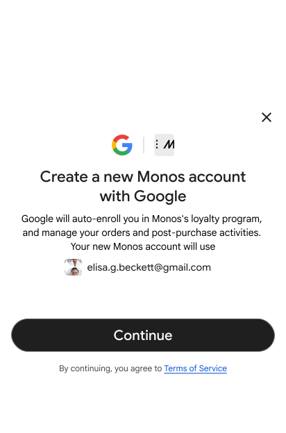

---
hide:
  - toc
---

  

    <h1>Universal Commerce Protocol</h1>
    

      The common language for consumers, agents and businesses.
    

    

      Discover products, Negotiate capabilities, Complete transactions. UCP defines the primitives for agentic commerce so platforms, businesses, and payment providers can interoperate through one standard, without custom builds.
    

  

  

    
  

  

    <h3>Learn</h3>
    
Protocol overview, core concepts, and design principles

    <a href="specification/overview/" class="promo-button">
      Read the docs
    </a>
  

  

    <h3>Implement</h3>
    
GitHub repo, technical spec, SDKs, and reference implementations

    <a href="https://github.com/Universal-Commerce-Protocol/ucp" class="promo-button">
      View on GitHub
    </a>
  

  <h2 style="font-size: 2.5rem; font-weight: 500; color: #202124; margin-bottom: 20px;">
    Created and adopted by industry partners
  </h2>

  

    UCP is co-developed with foundational partners like Shopify, Target, Walmart, Etsy, and Wayfair to ensure it solves real-world retail pain points, not just tech theory.
  

  

    
    Google

    
    Shopify

    
    Wayfair
  

  

    
    Etsy

    
    Target

    
    Walmart
  

<section class="action-carousel-section">
  <h2>See it in action</h2>

  

    <button class="tab-btn active" onclick="openTab(event, 'tab-checkout')">Checkout</button>
    <button class="tab-btn" onclick="openTab(event, 'tab-identity')">Identity Linking</button>
    <button class="tab-btn" onclick="openTab(event, 'tab-order')">Order</button>
  

  

    

      

        

           
        

        
SEE IT IN ACTION

        <h3>Checkout</h3>
        
Support complex cart logic, dynamic pricing, and tax calculations across millions of merchants through unified checkout sessions.

        <a href="specification/checkout-rest/" class="learn-more-btn">Learn more</a>
      

      

        

           
        

        

           <code>// Code snippet space...</code>
        

      

    

    

      

        

           
        

        
SEE IT IN ACTION

        <h3>Identity Linking</h3>
        
OAuth 2.0 standard enables agents to maintain secure, authorized relationships without sharing credentials.

        <a href="specification/identity-linking/" class="learn-more-btn">Learn more</a>
      

      

        

           
        

        

           <code>// Code snippet space...</code>
        

      

    

    

      

          

            
        

        
SEE IT IN ACTION

        <h3>Order</h3>
        
From purchase confirmation to delivery. Real-time web-hooks power status updates, shipment tracking, and return processing across every channel.

        <a href="specification/order/" class="learn-more-btn">Learn more</a>
      

      

        

           
        

        

           <code>// Code snippet space...</code>
        

      

    

</section>

  

    

      
    

    <h3 style="font-size: 1.5rem; margin: 0 0 15px 0; font-weight: 500; color: #202124;">Power native checkout UI</h3>
    

      Integrate and negotiate directly with the merchant checkout API to power native UI and workflows for your platform.
    

    <a href="specification/native/" class="md-button" style="background: #fff; border-radius: 24px; padding: 0.6rem 2rem; border: 1px solid #dadce0; color: #3c4043; font-weight: 500; text-transform: none;">See how it works</a>
  

  

    

      
    

    <h3 style="font-size: 1.5rem; margin: 0 0 15px 0; font-weight: 500; color: #202124;">Embed business checkout UI</h3>
    

      Embed your checkout UI within an iframe to support more complex checkout flows, with advanced capabilities like bidirectional communication, payments and shipping address handoffs.
    

    <a href="specification/embedded-checkout/" class="md-button" style="background: #fff; border-radius: 24px; padding: 0.6rem 2rem; border: 1px solid #dadce0; color: #3c4043; font-weight: 500; text-transform: none;">Learn more</a>
  

  <h2 style="font-size: 2.5rem; font-weight: 500; color: #202124;">UCP Principles</h2>

  

    

      
    

    

      <h3 style="font-size: 1.2rem; font-weight: 500; margin: 0 0 8px 0; color: #202124;">Scalable and universal</h3>
      

        Surface-agnostic design that can scale to support any commerce entity (from small merchants to enterprise builders) and all modalities (chat, visual commerce, voice, etc).
      

    

  

  

    

      
    

    

      <h3 style="font-size: 1.2rem; font-weight: 500; margin: 0 0 8px 0; color: #202124;">Open and extensible</h3>
      

        Open and extensible by design, enabling development of community-driven capabilities and extensions. Model your commerce, your way.
      

    

  

  

    

      
    

    

      <h3 style="font-size: 1.2rem; font-weight: 500; margin: 0 0 8px 0; color: #202124;">Businesses at the center</h3>
      

        Built to facilitate commerce, ensuring retailers retain control of their business rules and remains the Merchant of Record with full ownership of customer relationship.
      

    

  

  

    

      
    

    

      <h3 style="font-size: 1.2rem; font-weight: 500; margin: 0 0 8px 0; color: #202124;">Secure and private</h3>
      

        Built-on proven security standards for account linking (OAuth 2.0) and secure payment(Ap2) via payment mandates and verifiable credentials.
      

    

  

  

    

      
    

    

      <h3 style="font-size: 1.2rem; font-weight: 500; margin: 0 0 8px 0; color: #202124;">Frictionless payments</h3>
      

        Open wallet ecosystem with interoperability between providers to ensure buyers can pay with their preferred payment methods.
      

    

  

  <h2 style="font-size: 2.5rem; font-weight: 500; color: #202124; margin-bottom: 60px; line-height: 1.2; max-width: 800px; margin-left: auto; margin-right: auto;">
    The foundational open-source standard for the end-to-end commerce lifecycle
  </h2>

  

    

      

        
      

      <h3 style="font-size: 1.4rem; margin: 0 0 15px 0; font-weight: 500; color: #202124;">For Developers</h3>
      

        Build the future of commerce on an open foundation. Join our community in evolving an open-source standard designed for the next generation of digital trade.
      

      <a href="specification/overview/" style="color: #1a73e8; text-decoration: none; font-weight: 500; font-size: 0.95rem;">View the technical spec</a>
    

    

      

        
      

      <h3 style="font-size: 1.4rem; margin: 0 0 15px 0; font-weight: 500; color: #202124;">For Businesses</h3>
      

        UCP lets you meet customers wherever they are—AI assistants, shopping agents, embedded experiences—without rebuilding your checkout for each. Your existing payment stack stays intact.
      

      <a href="#" style="color: #1a73e8; text-decoration: none; font-weight: 500; font-size: 0.95rem;">Integrate with UCP</a>
    

    

      

        
      

      <h3 style="font-size: 1.4rem; margin: 0 0 15px 0; font-weight: 500; color: #202124;">For AI Platforms</h3>
      

        Simplify merchant onboarding with standardized APIs and provide your audience with an integrated shopping experience. Compatible with MCP, A2A, and existing agent frameworks.
      

      <a href="documentation/core-concepts/" style="color: #1a73e8; text-decoration: none; font-weight: 500; font-size: 0.95rem;">Learn more UCP core concepts</a>
    

  

  

    

      

        
      

      <h3 style="font-size: 1.4rem; margin: 0 0 15px 0; font-weight: 500; color: #202124;">For Payment Providers</h3>
      

        Universal payments that are provable—every authorization backed by cryptographic proof of user consent. Open, modular payment handler design enables open interoperability.
      

      <a href="documentation/ucp-and-ap2/" style="color: #1a73e8; text-decoration: none; font-weight: 500; font-size: 0.95rem;">Learn more about UCP and AP2</a>
    

    

      

        
      

      <h3 style="font-size: 1.4rem; margin: 0 0 15px 0; font-weight: 500; color: #202124;">For Shoppers</h3>
      

        Shop with absolute confidence. UCP ensures your preferred payment methods work across every agent and app, with a consistent checkout experience no matter where you buy.
      

      <a href="tutotials.md" style="color: #1a73e8; text-decoration: none; font-weight: 500; font-size: 0.95rem;">Learn more about the launch on Google's AI Mode in Search</a>
    

  

  <h2>Trusted by market leaders</h2>

  

    

      
      Adyen
    

    

      
      Ant International
    

    

      
      Best Buy
    

    

      
      Carrefour
    

    

      
      Chewy
    

    

      
      Commerce
    

    

      
      Etsy
    

    

      
      Flipkart
    

    

      
      Gap
    

    

      
      The Home Depot
    

    

      
      Kroger
    

    

      
      Lowe's
    

    

      
      Macy's
    

    

      
      Sephora
    

    

      
      Shopee
    

    

      
      Shopify
    

    

      
      Target
    

    

      
      Ulta
    

    

      
      Worldpay
    

    

      
      Zalando
    

  

  

    <h2 style="font-size: 2.5rem; font-weight: 500; color: #202124; margin-bottom: 30px; line-height: 1.2;">Get started today</h2>

    

      UCP is an open standard designed to let AI agents, apps, merchants, and payment providers interact seamlessly without needing custom, one-off integrations for every connection. We actively seek your feedback and contributions to help build the future of commerce.
    

    

      The complete technical specification, documentation, and reference implementations are hosted in our public GitHub repository.
    

  

  

    

      

        
      

      <h3 style="font-size: 1.4rem; font-weight: 400; color: #202124; margin: 0 0 15px 0;">Download</h3>
      
Download and run our code samples

    

    

      

        
      

      <h3 style="font-size: 1.4rem; font-weight: 400; color: #202124; margin: 0 0 15px 0;">Experiment</h3>
      
Experiment with the protocol and its different agent roles

    

    

      

        
      

      <h3 style="font-size: 1.4rem; font-weight: 400; color: #202124; margin: 0 0 15px 0;">Contribute</h3>
      
Contribute your feedback and code to the public repository

    

  

  

    <a href="https://github.com/Universal-Commerce-Protocol/ucp" style="display: inline-flex; align-items: center; gap: 12px; padding: 14px 32px; border: 1px solid #dadce0; border-radius: 50px; text-decoration: none; color: #3c4043; font-weight: 500; font-size: 1rem; transition: all 0.2s; background: #fff;">
      <svg height="24" width="24" viewBox="0 0 16 16" version="1.1" fill="#3c4043">
        <path d="M8 0C3.58 0 0 3.58 0 8c0 3.54 2.29 6.53 5.47 7.59.4.07.55-.17.55-.38 0-.19-.01-.82-.01-1.49-2.01.37-2.53-.49-2.69-.94-.09-.23-.48-.94-.82-1.13-.28-.15-.68-.52-.01-.53.63-.01 1.08.58 1.23.82.72 1.21 1.87.87 2.33.66.07-.52.28-.87.51-1.07-1.78-.2-3.64-.89-3.64-3.95 0-.87.31-1.59.82-2.15-.08-.2-.36-1.02.08-2.12 0 0 .67-.21 2.2.82.64-.18 1.32-.27 2-.27.68 0 1.36.09 2 .27 1.53-1.04 2.2-.82 2.2-.82.44 1.1.16 1.92.08 2.12.51.56.82 1.27.82 2.15 0 3.07-1.87 3.75-3.65 3.95.29.25.54.73.54 1.48 0 1.07-.01 1.93-.01 2.2 0 .21.15.46.55.38A8.013 8.013 0 0016 8c0-4.42-3.58-8-8-8z"></path>
      </svg>
      Visit the Github repository
    </a>
  

  

    
    Universal Commerce Protocol
  

