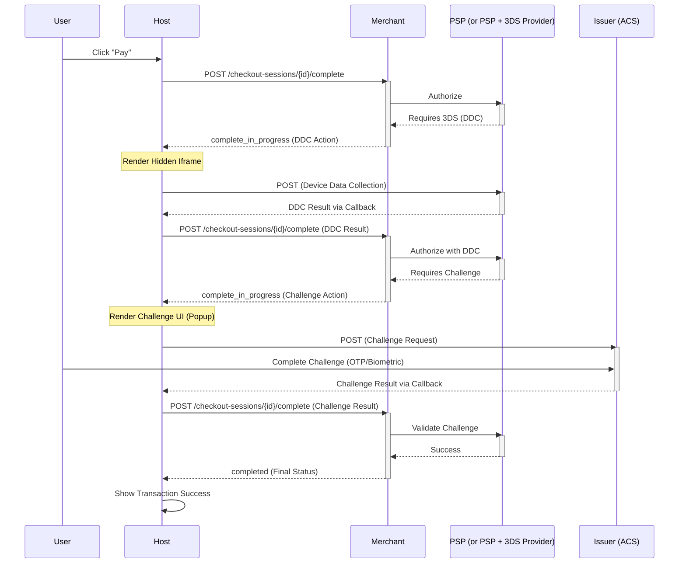

# Checkout 3DS2 Guide

This guide captures the proposed changes for UCP to support 3DS2 in a vendor-agnostic manner.

## Introduction

In a native UCP flow, the merchant delegates the UI to the host. This makes it impossible for the merchant to perform 3DS2 challenge flows since it requires loading iframes/popups. UCP spec is extended so the host can perform these actions while not having to worry about the underlying complexities of the 3DS2 flow, regardless of which 3DS2 Vendor is being used.

While this guide focuses on the 3DS2 solution, the schema and flow are defined in a generic manner. This ensures that the same pattern can be applied to future non-3DS challenge or step-up authentication flows as well.

## UCP Spec Enhancement

In this model, the **Merchant** acts as the orchestrator, and the **Host** acts as the execution environment for standardized 3DS2 actions.
The design uses `complete_in_progress` to signal that the checkout is in an intermediate state, awaiting the result of a 3DS2 action.

### Sequence Diagram



## Flow Phases

### Phase 1: Initial Request (Host -> Merchant)

The Host initiates completion and provides the `callback_url`.
Request: `POST /checkout-sessions/{id}/complete`
Example Payload:

```json
{
  "payment": {
    "instruments": [{
      "id": "pi_123",
      "handler_id": "gpay_1234",
      "type": "card",
      "selected": true,
      "display": {
        "brand": "mastercard",
        "last_digits": "5678",
        "rich_text_description": "Google Pay •••• 5678"
      },
      "credential": {
        "type": "PAYMENT_GATEWAY",
        "token": "examplePaymentMethodToken"
      },
      "challenge": {
        "callback_url": "https://p.g.com/challenge/callback/session_123"
      }
    }]
  },
  "signals": {
    "dev.ucp.browser_info": {
      "user_agent": "...",
      "color_depth": 24
    }
  }
}
```

### Phase 2: Device Data Collection (DDC) Loop

#### Step 2.1: Merchant Requests DDC (Merchant -> Host)

The Merchant returns a `complete_in_progress` status.
Response:

```json
{
  "status": "complete_in_progress",
  "payment": {
    "instruments": [{
      "id": "pi_123",
      "challenge": {
        "callback_url": "https://pay.google.com/3ds/callback/session_123",
        "action": {
          "intent": "device_data_collection",
          "type": "hidden_iframe",
          "url": "https://psp-endpoint.com/3ds-method",
          "request_data": { "threeDSMethodData": "eyJ0aHJlZURTU2VydmVy..." },
          "request_method": "POST"
        }
      }
    }]
  }
}
```

#### Step 2.2: Host Submits DDC Result (Host -> Merchant)

The Host renders the hidden iframe. Once it completes, the Host resumes the complete call.
Request: `POST /checkout-sessions/{id}/complete`

```json
{
  "payment": {
    "instruments": [{
      "id": "pi_123",
      "challenge": {
        "callback_url": "https://pay.google.com/3ds/callback/session_123",
        "result": {
          "intent": "device_data_collection",
          "status": "success",
          "response_data": { "SessionId": "xyz_789" }
        }
      }
    }]
  }
}
```

### Phase 3: Challenge Loop

#### Step 3.1: Merchant Requests Challenge (Merchant -> Host)

If step-up auth is required, Merchant sends another `complete_in_progress` with `challenge` intent.
Response:

```json
{
  "status": "complete_in_progress",
  "payment": {
    "instruments": [{
      "id": "pi_123",
      "challenge": {
        "callback_url": "https://pay.google.com/3ds/callback/session_123",
        "action": {
          "intent": "challenge",
          "type": "popup",
          "url": "https://bank-acs.com/challenge",
          "request_data": { "creq": "eyJtZXNzYWdlVHlwZSI6..." },
          "request_method": "POST"
        }
      }
    }]
  }
}
```

#### Step 3.2: Host Submits Challenge Result (Host -> Merchant)

Host renders UI, captures `cres`, and passes it back.
Request: `POST /checkout-sessions/{id}/complete`

```json
{
  "payment": {
    "instruments": [{
      "id": "pi_123",
      "challenge": {
        "callback_url": "https://pay.google.com/3ds/callback/session_123",
        "result": {
          "intent": "challenge",
          "status": "success",
          "response_data": { "cres": "A1B2C3D4..." }
        }
      }
    }]
  }
}
```

### Phase 4: Final Completion (Merchant -> Host)

Merchant validates result and returns final status.
Response:

```json
{
  "id": "chk_123",
  "status": "completed",
  "order": {
    "id": "ord_555",
    "total": "100.00",
    "currency": "GBP"
  }
}
```

## Summary of State Changes

| Flow State | API Status | Action Intent | Host Responsibility |
| :--- | :--- | :--- | :--- |
| Pre-Auth | `ready_for_complete` | N/A | Provide `callback_url` & `browser_info` |
| DDC | `complete_in_progress` | `device_data_collection` | Render hidden iframe; return success/fail |
| Challenge | `complete_in_progress` | `challenge` | Render user UI; return `cres` data |
| Success | `completed` | N/A | Display order confirmation |

## Host Implementation Considerations

### URL Security and Rendering

When processing challenge actions, the Host must consider security and rendering requirements:

* **Trusting the URL:** The `url` provided in the `action` object is generated by the PSP (or 3DS Provider). While validating the trustworthiness of this URL is out of scope for the UCP specification, the Host **SHOULD** take appropriate measures to ensure it only loads trusted endpoints (e.g., verifying against known PSP domains or using browser security policies).
* **Hidden Iframe Rendering:** For actions with `type: "hidden_iframe"` (e.g., Device Data Collection), the Host should render the iframe in a way that it is not visible to the user but still executes properly.

### Error Handling

The challenge flow introduces new failure modes that the Host must handle gracefully:

* **Standard Flow Execution:** If the challenge interaction completes successfully (via the hidden iframe or popup) and the Host receives the result data, it **MUST** resume the completion flow by calling `Complete Checkout` again with the received data.
* **Backend Validation Failure:** If the data returned from the challenge is invalid or the authorization fails at the PSP level, the Merchant will return a terminal error response (or another status) in the subsequent `Complete Checkout` call. The Host should handle this as a standard checkout error.
* **User Abandonment / Interactive Errors:** If the user enters an error state within the challenge UI or cannot proceed (e.g., the user manually dismisses the challenge popup before completion), this **SHOULD** be treated as a terminated session. The current checkout session becomes invalid for completion, and the user must initiate a new checkout session to try again.

## Risk Signals

To improve authentication success rates and optimize the frictionless flow, the
Host **SHOULD** collect and send a set of risk signals defined by EMVCo upfront
in the initial `Complete Checkout` call.

Surfacing these signals early allows the Issuer to make informed risk decisions
before a challenge is even requested. Additionally, this augments the signals
that might not be captured by the Device Data Collection (DDC) step in scenarios
where the DDC execution fails or is restricted (e.g., running in a webview where
custom JavaScript execution might be limited).

The specific browser signals are defined in the UCP schema. See the updated [signals.json](https://ucp.dev/schemas/shopping/types/signals.json) for details on fields such as `dev.ucp.browser.user_agent`, `dev.ucp.browser.buyer_ip`, and other device characteristics.
