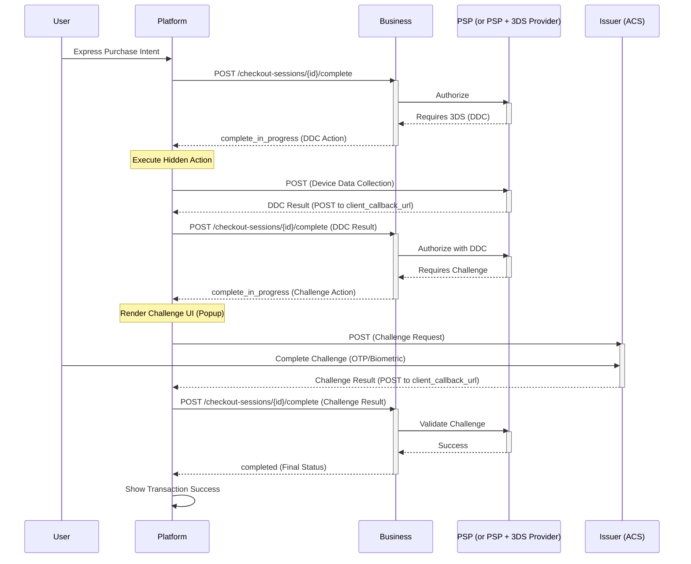

# Checkout 3DS2 Guide

This guide captures the proposed changes for UCP to support 3DS2 in a vendor-agnostic manner.

## Introduction

In a native UCP flow, the business delegates the UI to the platform. This makes it impossible for the business to perform 3DS2 challenge flows since it requires executing external interactions (like loading iframes or popups in a web context). UCP spec is extended so the platform can perform these actions while not having to worry about the underlying complexities of the 3DS2 flow, regardless of which 3DS2 Vendor is being used.

While this guide focuses on the 3DS2 solution, the schema and flow are defined in a generic manner. This ensures that the same pattern can be applied to future non-3DS challenge or step-up authentication flows as well.

## UCP Spec Enhancement

In this model, the **Business** acts as the orchestrator, and the **Platform** acts as the execution environment for standardized 3DS2 actions.
The design uses `complete_in_progress` to signal that the checkout is in an intermediate state, awaiting the result of a 3DS2 action.

### Sequence Diagram



> **Note on Client Callback URL:** The "Client Callback" in the sequence diagram typically refers to the interaction where the Issuer/PSP posts the result to the Platform's `client_callback_url` within the client execution context (e.g., iframe or popup, acting as the 3DS Notification URL). The Platform then relays this data to the Business via the `/complete` endpoint.

## Flow Phases

> **Note on Open-Ended Payloads:** The contents of `action` and `action_result` objects are based on the PSP's own specification that the Platform or Payment Handler can handle, which is outside the scope of UCP. They are provided in the examples below for illustrative purposes only.

### Phase 1: Initial Request (Platform -> Business)

The Platform initiates completion and provides the `client_callback_url`.
Request: `POST /checkout-sessions/{id}/complete`
Example Payload:

```json
{
  "payment": {
    "instruments": [{
      "id": "pi_123",
      "handler_id": "gpay_1234",
      "type": "card",
      "selected": true,
      "display": {
        "brand": "mastercard",
        "last_digits": "5678",
        "rich_text_description": "Google Pay •••• 5678"
      },
      "credential": {
        "type": "PAYMENT_GATEWAY",
        "token": "examplePaymentMethodToken"
      },
      "challenge": {
        "client_callback": {
          "url": "https://p.g.com/challenge/callback/session_123"
        }
      }
    }]
  },
  "signals": {
    "dev.ucp.browser_info": {
      "user_agent": "...",
      "color_depth": 24
    }
  }
}
```

### Phase 2: Device Data Collection (DDC) Loop

#### Step 2.1: Business Requests DDC (Business -> Platform)

The Business returns a `complete_in_progress` status.
Response:

```json
{
  "status": "complete_in_progress",
  "messages": [
    {
      "type": "error",
      "code": "challenge_required",
      "severity": "recoverable",
      "content": "Challenge required."
    }
  ],
  "payment": {
    "instruments": [{
      "id": "pi_123",
      "challenge": {
        "client_callback": {
          "url": "https://pay.google.com/3ds/callback/session_123"
        },
        "intent": "device_data_collection",
        "display": "hidden",
        "expires_at": "2026-05-13T15:00:00Z",
        "action": {
          "url": "https://psp-endpoint.com/3ds-method",
          "request_data": { "threeDSMethodData": "eyJ0aHJlZURTU2VydmVy..." },
          "request_method": "POST"
        }
      }
    }]
  }
}
```

#### Step 2.2: Platform Submits DDC Result (Platform -> Business)

The Platform executes the hidden action. Once it completes, the Platform resumes the complete call.
Request: `POST /checkout-sessions/{id}/complete`

```json
{
  "payment": {
    "instruments": [{
      "id": "pi_123",
      "challenge": {
        "client_callback": {
          "url": "https://pay.google.com/3ds/callback/session_123",
          "status": "callback_received"
        },
        "intent": "device_data_collection",
        "action_result": {
          "response_data": { "SessionId": "xyz_789" }
        }
      }
    }]
  }
}
```

#### Frictionless Outcome (Alternative)

If the Business (via PSP) determines that the risk is low based on the DDC result and other signals, the Business may proceed to complete the transaction directly without requiring a challenge.

In this case, the response to the `POST /complete` call in Step 2.2 will return status `"completed"` immediately, skipping Phase 3 entirely. See [Phase 4: Final Completion](#phase-4-final-completion) for the response payload example.

### Phase 3: Challenge Loop

#### Step 3.1: Business Requests Challenge (Business -> Platform)

If step-up auth is required, Business sends another `complete_in_progress` with `challenge` intent.
Response:

```json
{
  "status": "complete_in_progress",
  "messages": [
    {
      "type": "error",
      "code": "challenge_required",
      "severity": "recoverable",
      "content": "Challenge required."
    }
  ],
  "payment": {
    "instruments": [{
      "id": "pi_123",
      "challenge": {
        "client_callback": {
          "url": "https://pay.google.com/3ds/callback/session_123"
        },
        "intent": "challenge",
        "display": "visible",
        "expires_at": "2026-05-13T15:00:00Z",
        "action": {
          "url": "https://bank-acs.com/challenge",
          "request_data": { "creq": "eyJtZXNzYWdlVHlwZSI6..." },
          "request_method": "POST"
        }
      }
    }]
  }
}
```

#### Step 3.2: Platform Submits Challenge Result (Platform -> Business)

Platform renders UI, captures the callback data, and passes it back. This step can have different outcomes depending on whether the interaction completed or was abandoned.

##### Scenario A: Callback Received

The Platform received the callback (e.g., form post or postMessage) from the Issuer/PSP and passes the data to the Business. The Platform does not determine success or failure of the authentication itself; it simply reports that the callback was received.

Request: `POST /checkout-sessions/{id}/complete`

```json
{
  "payment": {
    "instruments": [{
      "id": "pi_123",
      "challenge": {
        "client_callback": {
          "url": "https://pay.google.com/3ds/callback/session_123",
          "status": "callback_received"
        },
        "intent": "challenge",
        "action_result": {
          "response_data": { "cres": "A1B2C3D4..." }
        }
      }
    }]
  }
}
```

**Business Response**:

- If the authentication was successful, the Business proceeds to complete the order (see [Phase 4](#phase-4-final-completion)).
- If the authentication failed (e.g., wrong OTP) or timed out, the Business returns a recoverable error with status `ready_for_complete` to allow a clean retry or instrument switch:

```json
{
  "status": "ready_for_complete",
  "messages": [
    {
      "type": "error",
      "code": "payment_failed",
      "severity": "recoverable",
      "content": "Authentication failed. Please try again."
    }
  ]
}
```

*In this case, the Platform can ask the user to try again. The user may use the same card or another card, and it will be sent as a new completion attempt with a new payment instrument and token.*

##### Scenario B: User Abandonment & Instrument Switching

The user abandons the challenge (e.g., closes popup). The Platform allows the user to switch to a new payment instrument. The Platform initiates a new completion attempt by calling `POST /complete` again, sending both instruments for context.

Request: `POST /checkout-sessions/{id}/complete`

```json
{
  "payment": {
    "instruments": [
      {
        "id": "pi_new_456",
        "handler_id": "gpay_5678",
        "type": "card",
        "selected": true,
        "credential": {
          "type": "PAYMENT_GATEWAY",
          "token": "newPaymentMethodToken"
        }
      },
      {
        "id": "pi_123",
        "handler_id": "gpay_1234",
        "type": "card",
        "selected": false,
        "challenge": {
          "client_callback": {
            "url": "https://pay.google.com/3ds/callback/session_123",
            "status": "abandoned"
          },
          "intent": "challenge"
        }
      }
    ]
  }
}
```

### Phase 4: Final Completion

Business validates result and returns final status.

Response:

```json
{
  "id": "chk_123",
  "status": "completed",
  "payment": {
    "instruments": [
      {
        "id": "pi_123",
        "challenge": {
          "status": "frictionless"
        }
      }
    ]
  }
}
```

## Summary of State Changes

| Flow State | API Status | Action Intent | Platform Responsibility |
| :--- | :--- | :--- | :--- |
| Pre-Auth | `ready_for_complete` | N/A | Provide `client_callback.url` & `browser_info` |
| DDC | `complete_in_progress` | `device_data_collection` | Execute hidden action; return `client_callback.status` |
| Challenge | `complete_in_progress` | `challenge` | Render user UI; return `client_callback.status` |
| Success | `completed` | N/A | Display order confirmation |

## Challenge Delegation and Fallback

If no compatible payment handler can be agreed upon between the Platform and Business during capability negotiation (which occurs well before the completion phase), the buyer should be escalated to the Business-hosted flow via `continue_url` to avoid a runtime dead-end. Platforms that cannot render challenge UIs or execute hidden actions should not advertise support for payment handlers that require them (e.g., most card handlers).

> **Note on Platform Commitment:** When a Platform initiates completion (`POST /complete`) for a specific payment handler, it is treated as a commitment that the Platform can execute that handler's full runtime contract, including any required challenge or step-up authentication flows (like 3DS2). The Business does not perform conditional checks at runtime to verify if the Platform supports challenges.

## URL Security and Action Execution

When processing challenge actions, the Platform must consider security and action execution requirements:

- **Trusting the URL:** The `url` provided in the `action` object is generated by the PSP. To prevent loading malicious URLs in case of a compromised Business, the Platform **SHOULD** verify trust independently. This can be achieved by fetching the Payment Handler's published schema (hosted at a trusted, PSP-owned URL referenced in the platform profile) and validating the `url` against the `allowed_challenge_urls` patterns declared by the PSP in that schema. This ensures the Platform has a verification source independent of the Business.
- **Hidden Action Execution:** For actions with `display: "hidden"` (e.g., Device Data Collection), the Platform should execute the interaction in a way that it is not visible to the user but still runs to completion (e.g., using a hidden iframe in a web context or a background webview in a native app).

## Risk Signals

To improve authentication success rates and optimize the frictionless flow, the Platform **SHOULD** collect and send a set of risk signals defined by EMVCo upfront in the initial `Complete Checkout` call.

Surfacing these signals early allows the Issuer to make informed risk decisions before a challenge is even requested. Additionally, this augments the signals that might not be captured by the Device Data Collection (DDC) step in scenarios where the DDC execution fails or is restricted (e.g., running in a webview where custom JavaScript execution might be limited).

The specific browser signals are defined in the UCP schema under the `dev.ucp.browser_info.*` namespace, based on the EMVCo requirements outlined in the [EMVCo 3-D Secure Whitepaper](https://www.emvco.com/dynamic/emv-3-d-secure-whitepaper-v2/improving-risk-emv-3-d-secure-whitepaper-v2-analysis-and-frictionless-flow/technical-features/). See signals.json for details.

Businesses and platforms **MAY** extend these signals to include additional device or environment signals as needed to further support risk analysis and fraud prevention, following the reverse-domain naming convention.

## Out-of-Band Authentication

There are authentication flows where no direct browser interaction is needed (e.g., out-of-band approval via a banking app). In these cases, the Platform might not need to render a UI for the challenge but instead show a waiting state.

There are high-level approaches to solve the completion signaling for out-of-band challenges:

1. **Hidden Execution Approach:** The Business or its PSP can run a hidden background interaction on the frontend (e.g., an iframe) to poll or wait for the completion signal from the ACS, and then trigger the standard callback to the Platform upon completion.
2. **Server-to-Server Webhooks:** The Business (or PSP) can notify the Platform about the completion via a server-to-server webhook, allowing the Platform to resume without relying on client-side polling.

> **TODO:** Expand on the details of Out-of-Band authentication flows, including timeout handling and specific status signaling.

## Error Handling and Recovery

The challenge flow introduces failure modes that the Platform must handle. UCP leverages the standard `messages` array with `severity: "recoverable"` to guide the Platform when issues occur.

### Recoverable Errors

For errors that are specific to the selected payment instrument or transient in nature, the Business will return `severity: "recoverable"`. In these cases, the Platform can send a new request to complete checkout passing a payment token either for the same instrument or a new instrument, based on the platform's flow and the user interaction.

| Code | Severity | Meaning / Platform Action |
| :--- | :--- | :--- |
| `challenge_required` | `recoverable` | A challenge or device data collection is required to proceed. The Platform should inspect the `challenge` object in the response to determine the next action. |
| `payment_instrument_not_enrolled` | `recoverable` | The card is not enrolled in 3DS. The Platform should guide the buyer to use a different payment instrument. |
| `payment_failed` | `recoverable` | The authentication validation failed. The Platform may allow the user to retry the challenge or guide them to switch to a different payment instrument. |
| `risk_rejected` | `recoverable` | The transaction was rejected due to high risk for this specific instrument. The Platform should guide the buyer to use a different payment instrument. |
| `payment_timeout` | `recoverable` | The ACS or 3DS server timed out. The Platform may allow the user to retry the operation or guide them to switch to a different payment instrument. |

### Abandonment and Instrument Switching

If the user abandons the challenge flow (e.g., dismisses the popup) or encounters an error that prevents receiving a callback, the Platform should also allow the user to switch instruments.

When the user switches to a new payment instrument after abandonment, the Platform initiates a new completion attempt by calling `POST /complete` again. In this request, the Platform **MUST** send both instruments in the `payment.instruments` array to provide full context and explicit instructions to the Business:

1. **The New Instrument**: Marked as `selected: true`, containing the new payment token for the fresh completion attempt.
2. **The Old Instrument**: Marked as `selected: false`, with its `challenge.client_callback.status` set to `"abandoned"`.

This allows the Business to process the new instrument while retaining the context of the previous failure.

> **Note on State Transition:** There is no need for the Business to change the session status back from `complete_in_progress` to `ready_for_complete` when switching instruments. Technically, the completion is still in progress, and the Platform is able to provide the new instrument in the subsequent `/complete` call without requiring an explicit intermediate state transition.

### Non-Recoverable Errors

For terminal failures that are not specific to the payment instrument, the Business will return `severity: "unrecoverable"`. In these cases, the session is terminated.

| Code | Severity | Meaning |
| :--- | :--- | :--- |
| `system_error` | `unrecoverable` | A technical error occurred on the Business or PSP side. |
